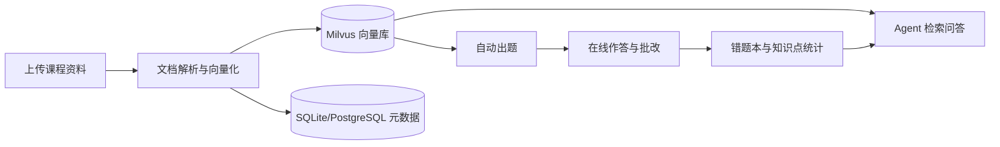
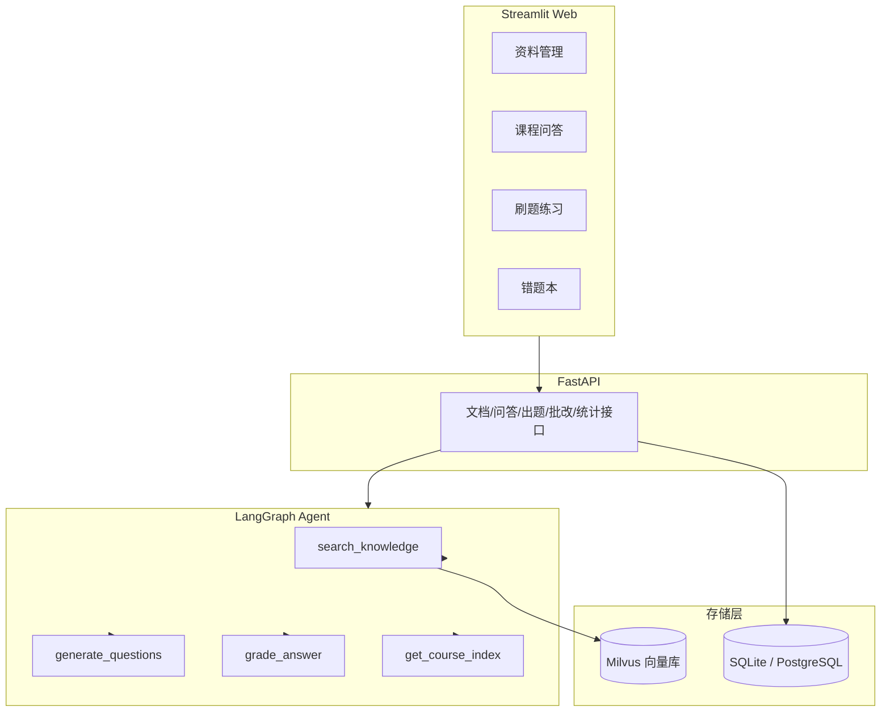

# 📚 CourseMate：课程学习与刷题助手

一个面向「课程资料学习 + 刷题巩固」的单 Agent 多工具 Web 应用。上传课程资料后，可以针对资料提问、自动出题、在线作答并批改，最后通过错题本复盘薄弱知识点。

## 功能闭环



四大功能：

1. **资料管理**：上传 PDF / Markdown / TXT，自动解析、切分、向量化入库；支持删除。
2. **课程问答**：Agent 检索课程资料后回答，回答带来源引用；支持多会话管理
   （新建/切换/删除，SQLite 持久化，重启后记录不丢）；长对话自动上下文压缩
   （增量摘要 + 最近消息窗口），控制 token 成本并保持连贯；
   资料中没有的内容会明确说明，不编造。
3. **刷题练习**：按课程、知识点、题型（单选/多选/简答/混合）自动生成题目，在线作答并批改。
4. **错题本**：历史作答记录、正确率、按题型与知识点的错误分布。

## 技术栈与架构

- **语言/工程**：Python 3.12、uv 项目管理
- **Agent 框架**：LangChain 1.x + LangGraph（ReAct 单 Agent，绑定 4 个工具）
- **模型**：DeepSeek（主模型）、硅基流动 bge-m3（Embedding API）
- **RAG**：LangChain Loader + RecursiveCharacterTextSplitter + Milvus 向量库
- **后端**：FastAPI（REST API，Swagger 文档）
- **前端**：Streamlit（四页面）
- **存储**：Milvus（向量）+ SQLite（默认业务数据）/ PostgreSQL（可选）

架构示意：



## 快速开始

### 1. 环境准备

- Python 3.12+，安装 [uv](https://docs.astral.sh/uv/)
- 可选：Docker Desktop（使用 Docker 版 Milvus 时）

### 2. 安装依赖

```bash
cd 个人项目
uv sync
```

### 3. 配置密钥

```bash
cp .env.example .env
# 编辑 .env，填入：
# DEEPSEEK_API_KEY   从 https://platform.deepseek.com 获取
# SILICONFLOW_API_KEY 从 https://cloud.siliconflow.cn 获取
```

### 4. 启动（二选一）

**方式 A：Milvus Lite（零 Docker，适合快速体验）**

默认配置 `MILVUS_URI=./data/milvus_lite.db`，直接启动即可：

```bash
# 终端 1：启动后端 API
uv run uvicorn coursemate.app.main:app --reload --port 8000

# 终端 2：启动 Web 界面
uv run streamlit run coursemate/web/app.py
```

打开 http://localhost:8501 使用。

**方式 B：Docker 版 Milvus + PostgreSQL（生产接近）**

```bash
# 1. 启动 Milvus 全家桶
docker compose up -d

# 2. 修改 .env
# MILVUS_URI=http://localhost:19530
# DATABASE_URL=postgresql+psycopg://postgres:密码@数据库地址:5432/coursemate

# 3. 启动后端与 Web（同上）
```

### 5. 导入演示资料（可选）

```bash
uv run python scripts/seed_demo.py
```

内置演示资料为 `data/demo/操作系统-进程与调度.md`，导入后即可直接体验问答与刷题。

## 项目结构

```text
个人项目/
├── coursemate/
│   ├── config.py          # 全局配置（.env）
│   ├── agent/             # Agent 层：LLM、Schema、工具、LangGraph Agent、上下文压缩
│   ├── app/               # FastAPI 层：路由、文档入库服务、请求模型
│   ├── db/                # SQLAlchemy 模型、会话、仓库函数（含课程问答会话/消息）
│   ├── rag/               # 文档加载/切分、Embedding、Milvus 向量库
│   └── web/               # Streamlit 前端（4 个页面）
├── docs/                  # 设计文档（含课程问答会话管理设计）
├── scripts/
│   ├── seed_demo.py       # 导入演示资料
│   └── demo_e2e.py        # 端到端功能验证脚本
├── data/
│   ├── demo/              # 演示资料
│   ├── uploads/           # 上传的文档原文
│   └── coursemate.db      # SQLite 业务数据（自动生成）
├── tests/                 # 单元测试
├── docker-compose.yml     # Milvus + etcd + MinIO
├── .env.example           # 环境变量模板
└── pyproject.toml
```

## API 一览（Swagger：http://localhost:8000/docs）

| 方法 | 路径 | 说明 |
| ---- | ---- | ---- |
| GET | `/courses` | 课程列表 |
| POST | `/courses` | 创建课程 |
| GET | `/documents` | 文档列表 |
| POST | `/documents` | 上传文档入库（multipart：file + course_name） |
| DELETE | `/documents/{id}` | 删除文档（含向量） |
| POST | `/chat` | Agent 对话（支持多轮 history 与 session_id；长对话自动上下文压缩） |
| GET | `/chat/sessions` | 会话列表（按最后活动时间倒序） |
| POST | `/chat/sessions` | 新建会话（可绑定课程范围） |
| GET | `/chat/sessions/{id}/messages` | 读取某会话的全部消息 |
| DELETE | `/chat/sessions/{id}` | 删除会话（级联删除消息） |
| POST | `/questions/generate` | 自动出题 |
| POST | `/questions/{id}/grade` | 批改作答 |
| GET | `/stats/mistakes` | 错题统计 |
| GET | `/health` | 健康检查 |

## 测试

```bash
uv run pytest -q
```

覆盖：文档加载与切分、空 PDF 报错、课程/文档/题目/作答的仓库逻辑、错题统计、
会话与消息持久化、上下文压缩（增量摘要/失败降级）、出题与批改的 Schema 校验，
以及问答/刷题/错题本页面的 Streamlit AppTest 交互测试。

## 技术选型理由

- **单 Agent 多工具**：检索、出题、批改、索引四个能力由同一 Agent 编排，结构清晰、易调试，适合一周内交付。
- **Milvus + SQLite/PostgreSQL 分离**：向量检索与业务数据解耦；本地零依赖可跑（Milvus Lite），需要时可无缝切换 Docker 版 Milvus。
- **DeepSeek + 硅基流动**：中文效果好、成本低；Embedding 用 API 避免本地模型安装负担。
- **FastAPI + Streamlit**：后端接口标准、可测试、自带 Swagger；前端四页面按功能组织，演示直观。

## 已知限制与后续方向

- 当前为单用户本地模式，未做登录与多租户。
- 错题本提供统计与列表，未做个性化推荐。
- PDF 仅支持带文本层的文件，扫描件需先 OCR（可接入 MinerU）。
- 后续可扩展：多 Agent 编排（检索/出题/批改子 Agent）、会话重命名与消息编辑、学习报告生成。
