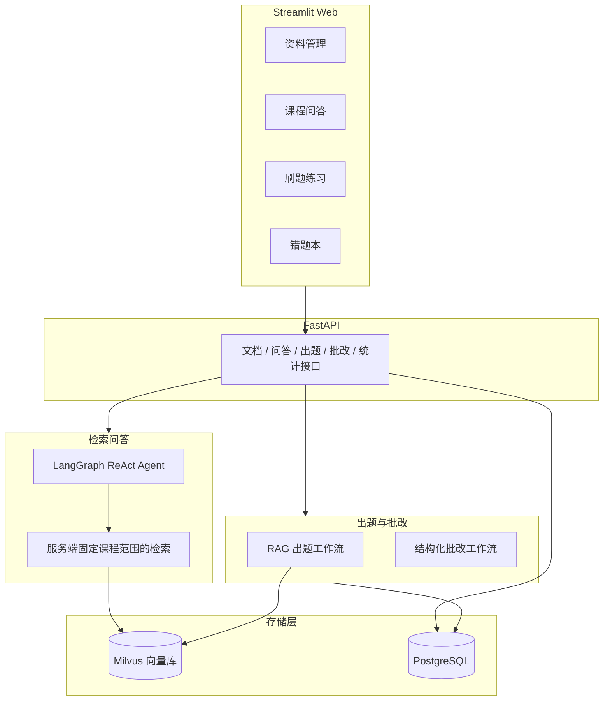

# CourseMate 技术文档

> 版本：v0.1.0 ｜ 更新日期：2026-08-16 ｜ 适用范围：`个人项目/coursemate` 源码

## 1. 项目概述

CourseMate 是一个面向「课程资料学习 + 刷题巩固」的 Web 应用。用户上传课程资料后，系统完成「解析切分 → 向量化入库 → 检索问答 → 自动出题 → 在线作答与批改 → 错题统计与复习」这条数据链路。检索问答由 LangGraph ReAct Agent 编排；出题和批改由 API 直接执行固定的 RAG + 结构化 LLM 工作流。

功能模块：

1. **资料管理**：上传 PDF / Markdown / TXT / Word（.docx），自动解析、切分、向量化入库；支持删除。
2. **课程问答**：Agent 检索课程资料后回答并带来源引用；支持多会话管理（新建/切换/删除，PostgreSQL 持久化）；长对话自动上下文压缩。
3. **刷题练习**：按课程、知识点、题型自动出题，在线作答并批改。
4. **错题本**：历史作答统计、按题型/知识点分布，近期错题可按题型/知识点筛选。

## 2. 技术栈

| 层 | 选型 |
| --- | --- |
| 语言 / 工程 | Python 3.12、uv |
| 问答 Agent | LangChain 1.x + LangGraph（ReAct，`create_react_agent`） |
| 刷题工作流 | RAG 检索 + Pydantic 结构化 LLM 输出（固定步骤） |
| 模型 | DeepSeek（主模型）、硅基流动 bge-m3（Embedding API） |
| RAG | LangChain Loader + RecursiveCharacterTextSplitter + Milvus |
| 后端 | FastAPI + uvicorn（REST API，自带 Swagger） |
| 前端 | Streamlit（四个页面） |
| 存储 | Docker/远程 Milvus（向量）+ PostgreSQL（业务数据与测试） |
| 可观测性 | LangSmith（可选，设置密钥即自动 trace） |

## 3. 系统架构



### 3.1 数据流

1. **资料入库**：上传文件 → 保存原文 → 创建 `pending` 元数据 → 解析切分 → 写入 Milvus → 更新为 `ready`；失败时执行向量/原文补偿并记录 `ingest_failed`。
2. **课程问答**：页面发送问题 → `/chat/stream`（或 `/chat`）解析或创建固定课程会话 → 读取历史并压缩 → LangGraph Agent 调用服务端限域的 `search_knowledge` → 生成回答 → 用户消息与回答落库。
3. **出题与批改**：API 不经过 Agent 自主选路。出题按「课程内检索 → 结构化生成 → 持久化 → 公开字段映射」执行；批改按「读取题目与参考答案 → 课程内检索 → 结构化批改 → 记录作答 → 返回答案与解析」执行。
4. **错题统计**：`/stats/mistakes` 汇总作答记录，支持按课程、题型、知识点过滤近期错题。

## 4. 目录结构

```text
个人项目/
├── coursemate/
│   ├── config.py          # 全局配置（.env / 环境变量）
│   ├── agent/             # Agent 层：LLM、Schema、工具、LangGraph Agent、上下文压缩
│   ├── app/               # FastAPI 层：路由、文档入库服务、请求/响应模型
│   ├── db/                # SQLAlchemy 模型、会话管理、仓库函数（含问答会话/消息）
│   ├── rag/               # 文档加载/切分、Embedding、Milvus 向量库
│   ├── evaluation.py      # RAG 检索/忠实度评估逻辑
│   └── web/               # Streamlit 前端（4 个页面 + API 客户端 + 批改状态管理）
├── docs/                  # 设计文档（含课程问答会话管理设计）
├── migrations/            # Alembic 配置与版本迁移脚本
├── scripts/               # seed_demo.py 导入、demo_e2e.py 验证、eval_rag.py 评估、cleanup_orphans.py 清理
├── data/                  # 演示资料、评估集与上传原文
├── tests/                 # 单元、PostgreSQL 迁移和远程 Milvus 集成测试
├── 项目文档/              # 本文档与接口文档
├── docker-compose.yml     # Milvus + etcd + MinIO
└── pyproject.toml         # 依赖与构建配置（uv）
```

## 5. 核心功能设计

### 5.1 资料入库链路

入口为资料管理页 → `POST /documents` → `ingestion.ingest_file`，按顺序执行：

1. **扩展名校验**（`validate_suffix`）：白名单 `.pdf / .md / .markdown / .txt / .docx`；旧版 `.doc` 返回「暂不支持旧版 .doc 文件，请先另存为 .docx 后上传」，其他类型返回「不支持的文件类型」。
2. **保存原文并登记状态**：原文写入 `data/uploads`，文件名使用 uuid；随后创建 `documents` 记录，初始状态为 `pending`、`chunk_count=0`。
3. **解析与切分**：PDF 使用 `PyPDFLoader`；文本类使用 `TextLoader`；`.docx` 使用 python-docx 提取段落与表格。切分参数为 `chunk_size=800`、`chunk_overlap=120`。空文档或无法解析的文档会进入失败补偿。
4. **写入向量**：每个片段 metadata 携带 `course_id / document_id / filename / source`，然后批量写入 Milvus。
5. **发布文档**：向量写入成功后，把文档更新为 `ready` 并记录实际 `chunk_count`。文档列表、课程列表和 Agent 索引只读取 `ready` 文档。
6. **失败补偿**：任一步抛出异常后，按 `document_id` 尝试删除已经写入的向量，再清理原文，最后把元数据更新为 `ingest_failed` 并写入 `last_error`。如果失败状态本身无法提交，异常会写入日志，超时 `pending` 仍可由清理脚本处理。

文档状态如下：

```text
pending -> ready
pending -> ingest_failed
ready / delete_failed / deleting -> deleting -> 元数据删除
deleting -> delete_failed
```

删除由 `delete_document_consistently` 编排：先提交 `deleting`，再依次删除 Milvus 向量和原文，最后删除数据库记录。资源删除失败时保留元数据并记录为 `delete_failed`；API 返回 `503`，再次请求同一文档会从失败状态重试。向量已经不存在时按幂等成功处理，因此「向量已删、原文删除失败」也能继续重试。

`scripts/cleanup_orphans.py` 使用 Milvus `query_iterator` 遍历全部 `document_id`，处理无向量的 `ready` 文档、超过阈值的 `pending / ingest_failed` 文档及空课程。默认 `--stale-hours 24`；`--dry-run` 只显示候选项。实际清理会复用同一可重试删除流程，删除失败时保留 `delete_failed` 并以非零状态退出。Milvus 为空但 PostgreSQL 仍有 `ready` 文档时，脚本默认拒绝实际删除；只有确认向量确实丢失后才能显式传入 `--allow-empty-milvus`。

### 5.2 RAG 问答与会话管理

`/chat` 由 `chat_service.run_chat` 编排：解析或创建会话 → 从数据库读取历史 → 上下文压缩 → 调用 Agent → 消息与摘要落库。
`/chat/stream`（`run_chat_stream`）走同样的编排，但用 `agent.stream(stream_mode="messages")` 逐 token 流式返回最终回答（跳过工具调用与思考 token），流结束后才落库，以 SSE 响应。

会话管理的约定：

- `session_id` 为空时自动新建会话；指定时历史一律从数据库读取，页面不再各自维护一份消息副本。
- `ChatSession.course_id` 是会话唯一的课程范围，创建后不可修改。全库会话的值为 `null`，固定课程会话保存对应课程 ID。
- 已有会话收到与自身范围不同的非空 `course_id` 时返回 `409`；切换课程必须创建新会话。创建会话或发起新对话时指定不存在的课程返回 `404`。
- `build_agent(course_id)` 在服务端闭包中固定 `search_knowledge` 的课程过滤，工具参数中没有可由模型覆盖的 `course_id`。固定课程 Agent 也不暴露全库课程索引工具。
- 会话标题由首条用户消息自动生成（取前 20 字）。
- 会话与消息持久化在 `chat_sessions` / `chat_messages` 两张表，删除会话级联删除消息。
- 数据库保存原始用户消息，不再写入包含课程 ID 的文本前缀。Agent 系统提示词仍约束引用资料来源，并在资料中没有答案时明确说明。

### 5.3 上下文压缩

长会话下把全部历史发给模型会超出上下文窗口并推高 token 成本，采用「增量摘要 + 最近消息窗口」：

- **触发条件**：消息数超过 20 条，或估算字符数超过 6000（估算按字符数计，不引入额外 tokenizer）。
- **压缩过程**：保留最近 10 条消息，更早的消息连同旧摘要交给 LLM 压缩成新的对话摘要，摘要持久化到会话表；再次超窗时做增量更新，不重复总结全部历史。
- **失败降级**：摘要生成失败时只发送最近 10 条，不阻塞用户提问。
- **作用范围**：压缩只影响发送给模型的内容，页面始终展示完整消息。

### 5.4 出题与批改

- **编排边界**：`/questions/generate` 与 `/questions/{question_id}/grade` 直接调用服务层，执行预先确定的检索和结构化 LLM 步骤，不经过 LangGraph Agent 的工具选择循环。
- **出题**（`service.generate_questions`）：先在指定课程内召回与主题相关的资料片段，再用 `with_structured_output(QuestionSet)` 强制模型按 Pydantic Schema 返回题目。数据库保存参考答案和解析，但公开响应 `QuestionPublicOut` 只包含 `id / course_id / qtype / topic / stem / options`。
- **批改**（`service.grade_answer`）：请求体只接收 `user_answer`，题目 ID 只来自路径。服务端读取题目、参考答案和课程范围，检索课程上下文后结构化输出 `GradeResult`。批改成功并保存作答记录后，`GradeOut` 才返回 `correct_answer` 与 `explanation`。
- **思考模式处理**：DeepSeek V4 默认开启思考模式，该模式不接受 `tool_choice`；结构化输出依赖 `tool_choice`，因此结构化调用统一 `get_llm(thinking=False)` 关闭思考模式，普通对话保持默认。
- **结构化输出重试**：出题与批改统一通过 `_invoke_structured()` 调用。仅当 Pydantic Schema 校验失败或 LangChain 输出解析失败时追加“完整返回 Schema 字段”的纠正指令并重试一次；网络、鉴权、限流及其他运行时异常不在业务层重复请求，连续两次结构错误会抛出最后一次异常。
- **多选题答案序列化**：前端提交选项字母（A、B、C…），解析层统一支持完整选项文本、字母映射、旧数据碎片回退三种格式，避免选项文本自身含「、」时被切碎导致识别失败。

### 5.5 错题本统计与筛选

`repo.mistake_stats` 提供：

- **聚合统计**：累计作答、答对次数、正确率、按题型/知识点分布，按课程过滤时为该课程的全局数据。
- **近期错题明细**：携带题干、完整选项、用户答案、正确答案、反馈、得分与时间；支持 `course_id / qtype / topic` 三个过滤条件，过滤发生在 50 条上限之前，避免分类后漏掉较早的错题。
- **页面交互**：顶部指标与分布展示全量数据；「近期错题」上方提供题型、知识点两个下拉框，可单独或组合筛选，筛选后为空时给出空状态提示。

## 6. 数据模型

| 表 | 关键字段 | 说明 |
| --- | --- | --- |
| `courses` | id、name（唯一）、description | 课程 |
| `documents` | id、course_id（FK）、filename、file_path、doc_type、chunk_count、status、last_error | 文档元数据；只有 `ready` 对公开列表和检索可见，失败原因记录在 `last_error` |
| `questions` | id、course_id（FK）、qtype、topic、stem、options（JSON）、answer、explanation | 出题后持久化；options 存选择题选项，简答题为空 |
| `answer_attempts` | id、question_id（FK）、user_answer、score、is_correct、feedback | 一次提交一条作答记录 |
| `chat_sessions` | id、course_id（FK 可空）、title、summary、created_at、updated_at | 问答会话；`course_id` 创建后固定，`null` 表示全库范围；summary 存上下文压缩摘要 |
| `chat_messages` | id、session_id（FK，级联删除）、role、content、created_at | 会话消息，按时间升序 |

### 6.1 数据库迁移

项目使用 Alembic 管理数据库结构，配置入口为 `alembic.ini`，版本脚本位于 `migrations/versions/`。首次启动和升级现有环境前执行：

```bash
uv run alembic upgrade head
```

迁移 `20260816_0001` 同时支持两种场景：空数据库会创建完整业务表与索引；旧数据库会增加 `documents.status / last_error`，并把已有文档迁移为 `ready`。迁移 `20260816_0002` 将全部业务时间列转换为带时区类型，并按 UTC 解释已有无时区数据。在线迁移由 `engine.begin()` 显式管理并提交外层事务，避免 `current_schema()` 查询触发 SQLAlchemy autobegin 后被 Alembic 识别为无人提交的外部事务。

## 7. 配置项

配置通过 `.env` 或环境变量读取（见 `coursemate/config.py`）：

| 配置 | 默认值 | 说明 |
| --- | --- | --- |
| `LLM_MODEL` | `deepseek-v4-flash` | 主模型 |
| `DEEPSEEK_API_KEY` / `DEEPSEEK_BASE_URL` | - / `https://api.deepseek.com` | DeepSeek 密钥与地址 |
| `EMBEDDING_MODEL` | `BAAI/bge-m3` | Embedding 模型（硅基流动） |
| `SILICONFLOW_API_KEY` / `SILICONFLOW_BASE_URL` | - / `https://api.siliconflow.cn/v1` | Embedding 密钥与地址 |
| `DATABASE_URL` | 必填 | PostgreSQL 连接；只接受 `postgresql://` 或 `postgresql+psycopg://` |
| `TEST_DATABASE_URL` | 测试时必填 | 独立的 `*_test` PostgreSQL 数据库，不得与开发库相同 |
| `MILVUS_URI` | 必填 | Docker/远程 Milvus 的 `http://` 或 `https://` 地址 |
| `MILVUS_TOKEN` / `MILVUS_COLLECTION` | 空 / `coursemate_kb` | 远程 Milvus 鉴权与集合名 |
| `UPLOAD_DIR` | `data/uploads` | 上传原文目录 |
| `MAX_UPLOAD_MB` | `50` | 单个上传文件大小上限，按 1024 × 1024 字节计算 |
| `CHUNK_SIZE` / `CHUNK_OVERLAP` | 800 / 120 | 切分参数 |
| `TOP_K` | 5 | 检索返回片段数 |
| `CHAT_SUMMARY_THRESHOLD_MESSAGES` | 20 | 触发压缩的消息数阈值 |
| `CHAT_HISTORY_CHAR_BUDGET` | 6000 | 触发压缩的估算字符预算 |
| `CHAT_KEEP_RECENT_MESSAGES` | 10 | 压缩后保留的最近消息条数 |
| `LANGSMITH_API_KEY` / `LANGSMITH_TRACING` | 空 / `false` | LangSmith 观测：填密钥并设 `true` 后自动 trace |
| `LANGSMITH_PROJECT` | `coursemate` | LangSmith 项目名 |

## 8. 测试策略

- 普通测试运行方式：`uv run pytest -m "not integration" -q`；远程 Milvus 冒烟测试使用 `uv run pytest tests/test_milvus_integration.py -m integration -q` 显式运行。
- 覆盖范围：文档加载与切分、入库状态与失败补偿、可重试删除、Alembic 空库/旧库迁移、仅 `ready` 可见、课程范围绑定与冲突、公开题目不泄露答案、批改接口契约、仓库逻辑、上下文压缩，以及问答/刷题/错题本页面的 Streamlit AppTest 交互测试。
- 页面测试用 AppTest 驱动真实页面、只 mock 外部 API，能稳定复现并锁定交互类问题。
- 数据库测试要求 `TEST_DATABASE_URL` 指向独立的 `*_test` PostgreSQL 数据库；每项测试创建随机 schema，结束后关闭连接并执行 `DROP SCHEMA ... CASCADE`。配置缺失、指向开发库或名称不以 `_test` 结尾时直接拒绝运行。
- 远程 Milvus 集成测试使用随机 `coursemate_test_*` 集合和本地确定性 Embedding，不调用硅基流动，并在 `finally` 中删除测试集合。

### 8.1 RAG 效果评估

评估入口 `scripts/eval_rag.py`，golden set 见 `data/eval/golden_set.json`，评分逻辑见 `coursemate/evaluation.py`：

- **关键词覆盖率**（确定性）：带课程过滤检索 top-k，看期望答案关键词被召回的比例；
- **文档命中率**（确定性）：不带过滤全局检索 top-k，看正确文档是否进 top-k；
- **答案忠实度**（LLM-as-judge）：检索上下文 → 只用上下文生成回答 → 判断回答是否忠于上下文（有无编造），复用 DeepSeek 结构化输出。

运行 `uv run python scripts/eval_rag.py --faithfulness` 输出两项检索指标与忠实度指标。注意：演示资料大部分文档仅 2-4 个 chunk，检索指标容易偏高；已扩充的 Java 文档约 20 个 chunk，可提供更有区分度的评估。

## 9. 部署与运行

PostgreSQL 与 Docker/远程 Milvus 都是必需服务，不提供 SQLite 或本地文件向量库回退。本地开发按以下顺序启动：

```bash
cd 个人项目
uv sync
docker compose up -d
# .env 中必须配置 DATABASE_URL 与 http(s):// 的 MILVUS_URI
uv run alembic upgrade head
# 终端 1：后端
uv run uvicorn coursemate.app.main:app --reload --port 8000
# 终端 2：Web 界面
uv run streamlit run coursemate/web/app.py
```

打开 http://localhost:8501 使用。

使用托管 Milvus 时无需启动本项目的 Docker Compose，但 `MILVUS_URI` 必须设置为服务商提供的 HTTPS 地址，并按要求配置 `MILVUS_TOKEN`。

## 10. 关键设计决策与约束

- **问答与刷题分开编排**：问答使用 LangGraph ReAct Agent；出题和批改由 API 直接调用固定的 RAG + 结构化 LLM 工作流，持久化仍收敛在 API 层。
- **服务端课程隔离**：`ChatSession.course_id` 是会话范围的唯一来源；固定课程 Agent 的检索工具由服务端闭包绑定范围，模型不能提供或覆盖课程 ID。
- **Milvus 动态字段过滤**：开启动态字段后 `course_id` 是顶层字段，过滤表达式直接写 `course_id == 1`，而不是 `metadata["course_id"] == 1`。
- **单一存储后端**：运行时和测试只允许 PostgreSQL，向量连接只允许 Docker/远程 Milvus；无效配置在启动或测试收集阶段立即失败，不做静默回退。
- **uv 平铺布局**：包根目录在项目根，需在 `pyproject.toml` 声明 `[tool.uv.build-backend] module-root = ""`，并清理残留的 `src` 空壳。
- **Streamlit 热重载边界**：页面脚本会热重载，但已 import 的依赖模块不会；修改 `api_client.py` 等被页面 import 的模块后必须重启服务。
- **状态机与补偿删除**：入库只有在向量完成后才发布为 `ready`；删除先标记 `deleting`，资源失败转为 `delete_failed` 并保留元数据供重试。
- **流式只回最终回答、流后落库**：`stream_mode="messages"` 会把工具调用块与思考 token 一并带出，通过 `isinstance(msg, AIMessageChunk) and content and not msg.tool_calls` 过滤，用户只看到干净答案；消息落库放在流结束后，避免流中途断开存进半截回答。
- **LangSmith 默认关闭**：trace 会把对话内容发到外部服务，故 `LANGSMITH_TRACING` 默认 `false`，仅在有 API Key 且显式置 `true` 时才同步环境变量并上报。

## 11. 已知限制与后续方向

已知限制：

- 单用户本地模式，无登录与多租户。
- PDF 仅支持带文本层的文件；Word 仅支持 .docx，旧版 .doc 需另存为 .docx。
- 依赖 DeepSeek / 硅基流动 API 密钥，clone 后需自行配置才能运行。
- 未做消息编辑与单条消息删除。

后续可扩展方向：会话重命名、消息单条删除与编辑、会话导出/搜索、个性化错题推荐、登录与多租户。

## 12. 参考文档

- `README.md`：功能说明、快速开始与 API 概览。
- `资料/问题分析.md`：开发与验证过程中 20 条问题复盘（现象/原因/方案/效果）。
