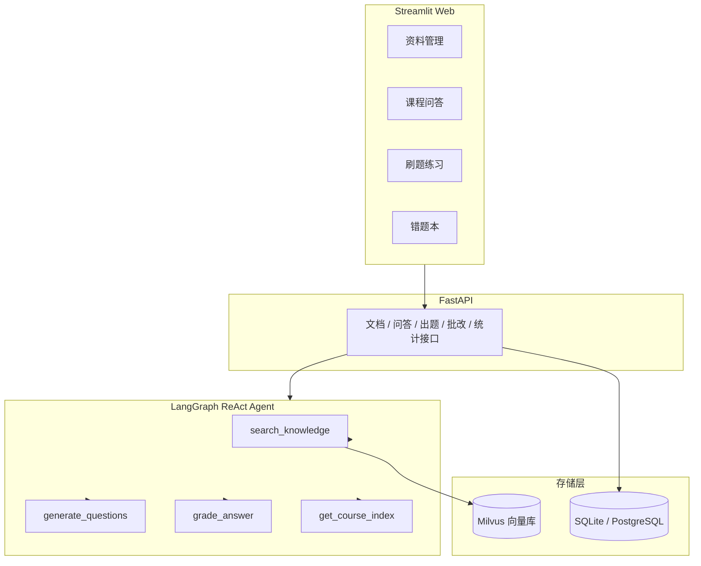

# CourseMate 技术文档

> 版本：v0.1.0 ｜ 更新日期：2026-08-15 ｜ 适用范围：`个人项目/coursemate` 源码

## 1. 项目概述

CourseMate 是一个面向「课程资料学习 + 刷题巩固」的单 Agent 多工具 Web 应用。用户上传课程资料后，系统完成「解析切分 → 向量化入库 → 检索问答 → 自动出题 → 在线作答与批改 → 错题统计与复习」这条数据链路。回答基于资料内容，资料中没有的内容会明确说明，不编造。

功能模块：

1. **资料管理**：上传 PDF / Markdown / TXT / Word（.docx），自动解析、切分、向量化入库；支持删除。
2. **课程问答**：Agent 检索课程资料后回答并带来源引用；支持多会话管理（新建/切换/删除，SQLite 持久化）；长对话自动上下文压缩。
3. **刷题练习**：按课程、知识点、题型自动出题，在线作答并批改。
4. **错题本**：历史作答统计、按题型/知识点分布，近期错题可按题型/知识点筛选。

## 2. 技术栈

| 层 | 选型 |
| --- | --- |
| 语言 / 工程 | Python 3.12、uv |
| Agent 框架 | LangChain 1.x + LangGraph（ReAct，`create_react_agent`） |
| 模型 | DeepSeek（主模型）、硅基流动 bge-m3（Embedding API） |
| RAG | LangChain Loader + RecursiveCharacterTextSplitter + Milvus |
| 后端 | FastAPI + uvicorn（REST API，自带 Swagger） |
| 前端 | Streamlit（四个页面） |
| 存储 | Milvus（向量，Lite / Standalone 双模式）+ SQLite（默认）/ PostgreSQL（可选） |
| 可观测性 | LangSmith（可选，设置密钥即自动 trace） |

## 3. 系统架构



### 3.1 数据流

1. **资料入库**：上传文件 → 扩展名校验 → 保存原文 → 解析为文本 → 切分片段 → 业务元数据写 SQLite、向量写 Milvus。
2. **课程问答**：页面发送问题 → `/chat/stream`（或 `/chat`）解析或创建会话 → 读取历史并压缩 → LangGraph Agent 调用 `search_knowledge` 检索 → 生成回答（流式逐 token 返回）→ 用户消息与回答落库。
3. **出题与批改**：`generate_questions` 先检索主题相关片段作为上下文，再用结构化输出生成题目并持久化；`grade_answer` 依据题目、参考答案、作答与上下文做结构化批改，作答记录落库。
4. **错题统计**：`/stats/mistakes` 汇总作答记录，支持按课程、题型、知识点过滤近期错题。

## 4. 目录结构

```text
个人项目/
├── coursemate/
│   ├── config.py          # 全局配置（.env / 环境变量）
│   ├── agent/             # Agent 层：LLM、Schema、工具、LangGraph Agent、上下文压缩
│   ├── app/               # FastAPI 层：路由、文档入库服务、请求/响应模型
│   ├── db/                # SQLAlchemy 模型、会话管理、仓库函数（含问答会话/消息）
│   ├── rag/               # 文档加载/切分、Embedding、Milvus 向量库
│   └── web/               # Streamlit 前端（4 个页面 + API 客户端 + 批改状态管理）
├── docs/                  # 设计文档（含课程问答会话管理设计）
├── scripts/               # seed_demo.py 演示资料导入、demo_e2e.py 端到端验证
├── data/                  # 演示资料、上传原文、SQLite / Milvus Lite 数据文件
├── tests/                 # 12 个测试文件，58 项自动化测试
├── 项目文档/              # 本文档与接口文档
├── docker-compose.yml     # Milvus + etcd + MinIO
└── pyproject.toml         # 依赖与构建配置（uv）
```

## 5. 核心功能设计

### 5.1 资料入库链路

入口为资料管理页 → `POST /documents` → `ingestion.ingest_file`，按顺序执行：

1. **扩展名校验**（`validate_suffix`）：白名单 `.pdf / .md / .markdown / .txt / .docx`；旧版 `.doc` 返回「暂不支持旧版 .doc 文件，请先另存为 .docx 后上传」，其他类型返回「不支持的文件类型」。
2. **保存原文**：写入 `data/uploads`，用 uuid 重命名避免冲突。
3. **解析**（`rag/loader.load_document`）：PDF 用 `PyPDFLoader`；文本类用 `TextLoader`；`.docx` 用 python-docx 按文档正文顺序提取段落与表格（单元格以 ` | ` 连接、行以换行分隔，图片等非文本内容忽略）。解析不到文本时抛 `DocumentParseError`（提示可能是扫描件 PDF 或空文档）。
4. **切分**（`split_documents`）：`chunk_size=800`、`chunk_overlap=120`，分隔符按中文标点（`。；`）优先断句，避免把句子拦腰截断。
5. **双写**：课程/文档记录写 SQLite（`courses`、`documents`），片段向量写 Milvus，每个片段 metadata 携带 `course_id / document_id / filename / source`，供后续按课程过滤。
6. **失败清理**：任一步失败都会删除已保存的原文，不留下半成品数据。

删除文档时保证「向量 + 原文 + 元数据」三处一致删除，避免出现文档已删但还能被检索到的脏数据。

### 5.2 RAG 问答与会话管理

`/chat` 由 `chat_service.run_chat` 编排：解析或创建会话 → 从数据库读取历史 → 上下文压缩 → 调用 Agent → 消息与摘要落库。
`/chat/stream`（`run_chat_stream`）走同样的编排，但用 `agent.stream(stream_mode="messages")` 逐 token 流式返回最终回答（跳过工具调用与思考 token），流结束后才落库，以 SSE 响应。

会话管理的约定：

- `session_id` 为空时自动新建会话；指定时历史一律从数据库读取，页面不再各自维护一份消息副本。
- 会话标题由首条用户消息自动生成（取前 20 字）。
- 会话与消息持久化在 `chat_sessions` / `chat_messages` 两张表，删除会话级联删除消息。
- Agent 系统提示词约束回答行为：使用工具、引用资料来源、资料中没有的内容明确说明。

### 5.3 上下文压缩

长会话下把全部历史发给模型会超出上下文窗口并推高 token 成本，采用「增量摘要 + 最近消息窗口」：

- **触发条件**：消息数超过 20 条，或估算字符数超过 6000（估算按字符数计，不引入额外 tokenizer）。
- **压缩过程**：保留最近 10 条消息，更早的消息连同旧摘要交给 LLM 压缩成新的对话摘要，摘要持久化到会话表；再次超窗时做增量更新，不重复总结全部历史。
- **失败降级**：摘要生成失败时只发送最近 10 条，不阻塞用户提问。
- **作用范围**：压缩只影响发送给模型的内容，页面始终展示完整消息。

### 5.4 出题与批改

- **出题**（`service.generate_questions`）：先用检索工具召回与主题相关的资料片段作为上下文，再用 `with_structured_output(QuestionSet)` 强制模型按 Pydantic Schema 返回题目，保证字段契约稳定。
- **批改**（`service.grade_answer`）：把题目、参考答案、学生作答、课程资料上下文、选项列表一起交给模型，结构化输出 `GradeResult`（对错、0-100 分、反馈、建议复习知识点）。
- **思考模式处理**：DeepSeek V4 默认开启思考模式，该模式不接受 `tool_choice`；结构化输出依赖 `tool_choice`，因此结构化调用统一 `get_llm(thinking=False)` 关闭思考模式，普通对话保持默认。
- **多选题答案序列化**：前端提交选项字母（A、B、C…），解析层统一支持完整选项文本、字母映射、旧数据碎片回退三种格式，避免选项文本自身含「、」时被切碎导致识别失败。

### 5.5 错题本统计与筛选

`repo.mistake_stats` 提供：

- **聚合统计**：累计作答、答对次数、正确率、按题型/知识点分布，按课程过滤时为该课程的全局数据。
- **近期错题明细**：携带题干、完整选项、用户答案、正确答案、反馈、得分与时间；支持 `course_id / qtype / topic` 三个过滤条件，过滤发生在 50 条上限之前，避免分类后漏掉较早的错题。
- **页面交互**：顶部指标与分布展示全量数据；「近期错题」上方提供题型、知识点两个下拉框，可单独或组合筛选，筛选后为空时给出空状态提示。

## 6. 数据模型

| 表 | 关键字段 | 说明 |
| --- | --- | --- |
| `courses` | id、name（唯一）、description | 课程 |
| `documents` | id、course_id（FK）、filename、file_path、doc_type、chunk_count | 文档元数据；doc_type 取扩展名（pdf/md/markdown/txt/docx） |
| `questions` | id、course_id（FK）、qtype、topic、stem、options（JSON）、answer、explanation | 出题后持久化；options 存选择题选项，简答题为空 |
| `answer_attempts` | id、question_id（FK）、user_answer、score、is_correct、feedback | 一次提交一条作答记录 |
| `chat_sessions` | id、course_id（FK 可空）、title、summary、created_at、updated_at | 问答会话；summary 存上下文压缩摘要 |
| `chat_messages` | id、session_id（FK，级联删除）、role、content、created_at | 会话消息，按时间升序 |

## 7. 配置项

配置通过 `.env` 或环境变量读取（见 `coursemate/config.py`）：

| 配置 | 默认值 | 说明 |
| --- | --- | --- |
| `LLM_MODEL` | `deepseek-v4-flash` | 主模型 |
| `DEEPSEEK_API_KEY` / `DEEPSEEK_BASE_URL` | - / `https://api.deepseek.com` | DeepSeek 密钥与地址 |
| `EMBEDDING_MODEL` | `BAAI/bge-m3` | Embedding 模型（硅基流动） |
| `SILICONFLOW_API_KEY` / `SILICONFLOW_BASE_URL` | - / `https://api.siliconflow.cn/v1` | Embedding 密钥与地址 |
| `DATABASE_URL` | `sqlite:///./data/coursemate.db` | SQLite 默认，可切 PostgreSQL |
| `MILVUS_URI` | `./data/milvus_lite.db` | 本地文件为 Milvus Lite；`http://...` 为 Docker 版 |
| `MILVUS_TOKEN` / `MILVUS_COLLECTION` | 空 / `coursemate_kb` | 远程 Milvus 鉴权与集合名 |
| `UPLOAD_DIR` | `data/uploads` | 上传原文目录 |
| `CHUNK_SIZE` / `CHUNK_OVERLAP` | 800 / 120 | 切分参数 |
| `TOP_K` | 5 | 检索返回片段数 |
| `CHAT_SUMMARY_THRESHOLD_MESSAGES` | 20 | 触发压缩的消息数阈值 |
| `CHAT_HISTORY_CHAR_BUDGET` | 6000 | 触发压缩的估算字符预算 |
| `CHAT_KEEP_RECENT_MESSAGES` | 10 | 压缩后保留的最近消息条数 |
| `LANGSMITH_API_KEY` / `LANGSMITH_TRACING` | 空 / `false` | LangSmith 观测：填密钥并设 `true` 后自动 trace |
| `LANGSMITH_PROJECT` | `coursemate` | LangSmith 项目名 |

## 8. 测试策略

- 共 12 个测试文件、58 项自动化测试，运行方式：`uv run pytest -q`。
- 覆盖范围：文档加载与切分（含 .docx 解析、空 PDF / 空 Word 报错）、课程/文档/题目/作答的仓库逻辑、错题统计与题型/知识点筛选、会话与消息持久化、上下文压缩（增量摘要 / 失败降级）、出题与批改的 Schema 校验，以及问答/刷题/错题本页面的 Streamlit AppTest 交互测试。
- 页面测试用 AppTest 驱动真实页面、只 mock 外部 API，能稳定复现并锁定交互类问题。
- 环境注意：uv 缓存目录异常时，设置 `UV_CACHE_DIR` 指向临时目录后再运行。

### 8.1 RAG 效果评估

评估入口 `scripts/eval_rag.py`，golden set 见 `data/eval/golden_set.json`，评分逻辑见 `coursemate/evaluation.py`：

- **关键词覆盖率**（确定性）：带课程过滤检索 top-k，看期望答案关键词被召回的比例；
- **文档命中率**（确定性）：不带过滤全局检索 top-k，看正确文档是否进 top-k；
- **答案忠实度**（LLM-as-judge）：检索上下文 → 只用上下文生成回答 → 判断回答是否忠于上下文（有无编造），复用 DeepSeek 结构化输出。

运行 `uv run python scripts/eval_rag.py --faithfulness` 输出两项检索指标与忠实度指标。注意：演示资料每文档仅 2-4 个 chunk，检索指标会被刷高，需换更大资料才具区分度。

## 9. 部署与运行

### 方式 A：Milvus Lite（默认，零 Docker）

```bash
cd 个人项目
uv sync
# 终端 1：后端
uv run uvicorn coursemate.app.main:app --reload --port 8000
# 终端 2：Web 界面
uv run streamlit run coursemate/web/app.py
```

打开 http://localhost:8501 使用。

### 方式 B：Docker 版 Milvus + PostgreSQL

```bash
docker compose up -d
# .env 中设置 MILVUS_URI=http://localhost:19530、DATABASE_URL=postgresql+psycopg://...
```

## 10. 关键设计决策与约束

- **工具保持纯函数**：Agent 的四个工具不直接写数据库，持久化收敛在 API 层，能力可单独调用、便于单测。
- **Milvus 动态字段过滤**：开启动态字段后 `course_id` 是顶层字段，过滤表达式直接写 `course_id == 1`，而不是 `metadata["course_id"] == 1`。
- **SQLite 路径归一化**：uvicorn 与 Streamlit 的工作目录可能不同，相对路径统一转绝对路径，避免数据库文件建到别处。
- **uv 平铺布局**：包根目录在项目根，需在 `pyproject.toml` 声明 `[tool.uv.build-backend] module-root = ""`，并清理残留的 `src` 空壳。
- **Streamlit 热重载边界**：页面脚本会热重载，但已 import 的依赖模块不会；修改 `api_client.py` 等被页面 import 的模块后必须重启服务。
- **删除一致性**：删除文档必须同时清理 Milvus 向量、上传原文与数据库记录。
- **流式只回最终回答、流后落库**：`stream_mode="messages"` 会把工具调用块与思考 token 一并带出，通过 `isinstance(msg, AIMessageChunk) and content and not msg.tool_calls` 过滤，用户只看到干净答案；消息落库放在流结束后，避免流中途断开存进半截回答。
- **LangSmith 默认关闭**：trace 会把对话内容发到外部服务，故 `LANGSMITH_TRACING` 默认 `false`，仅在有 API Key 且显式置 `true` 时才同步环境变量并上报。

## 11. 已知限制与后续方向

已知限制：

- 单用户本地模式，无登录与多租户。
- PDF 仅支持带文本层的文件；Word 仅支持 .docx，旧版 .doc 需另存为 .docx。
- 依赖 DeepSeek / 硅基流动 API 密钥，clone 后需自行配置才能运行。
- 未做消息编辑与单条消息删除。

后续可扩展方向：会话重命名、消息单条删除与编辑、会话导出/搜索、个性化错题推荐、多 Agent 编排（检索/出题/批改子 Agent）、登录与多租户。

## 12. 参考文档

- `README.md`：功能说明、快速开始与 API 概览。
- `docs/superpowers/specs/2026-08-14-课程问答会话管理-design.md`：会话管理与上下文压缩设计。
- `资料/问题分析.md`：开发与验证过程中 18 条问题复盘（现象/原因/方案/效果）。
